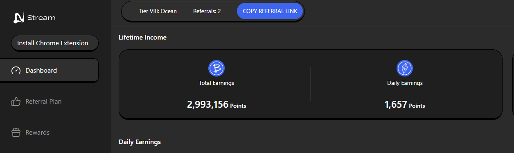

# AllStream Depin
Mine Data, Fuel AI, Earn Rewards Join the Stream AI Revolution


- Website [https://app.allstream.ai/](https://app.minionlab.ai/?referralCode=fxUrOLJs)
- Twitter/X [@allstream_ai](https://x.com/allstream_ai)

## Features

- **Auto Create Connections**
- **Support Multy Accounts**
- **Support Proxy** format `http://ip:port` or `http://username:password@ip:port` or `socks5://username:password@ip:port`


## Setup

1. Clone this repository:
   ```bash
   cd streamAi
   ```
2. Install dependencies:
   ```bash
   npm install
   ```
3. Setup: Paste userId to `userIds.txt` 1 line 1 account
   ```bash
   # 格式： 邮箱|密码 一行一个
   nano accounts.txt
   ```
4. Setup: paste proxy to `proxies.txt` 1 line 1 proxy
   ```bash
   # 格式：proxy,proxy,proxy，一个账号支持多组
   nano proxy.txt
   ```
5. Run The Script:
   ```bash
   npm run start
   ```


## 

This project is licensed under the [MIT License](LICENSE).


